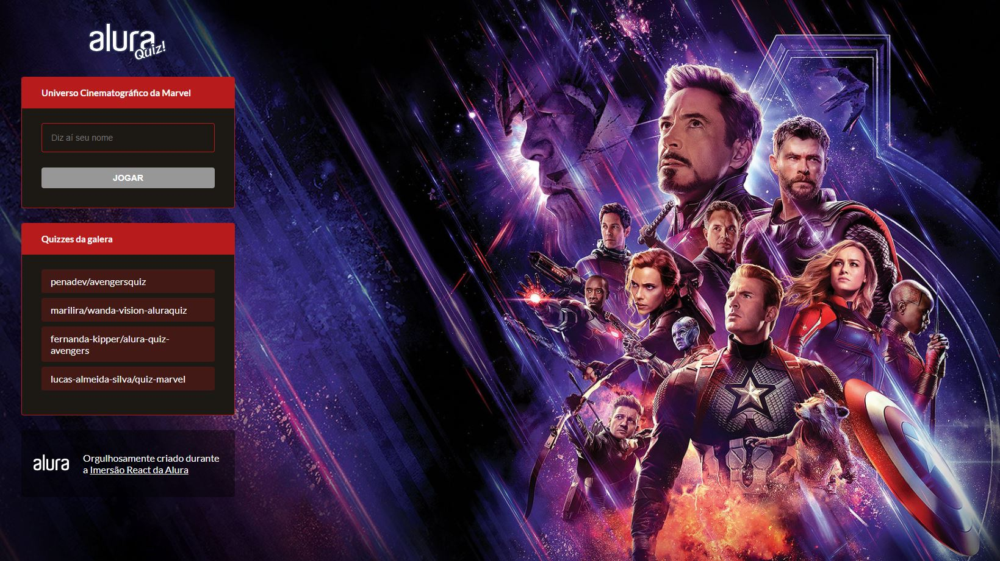
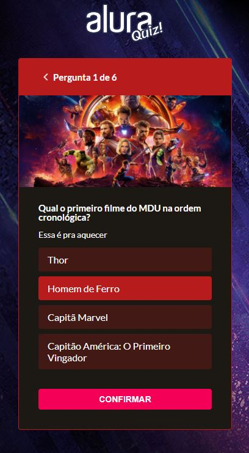
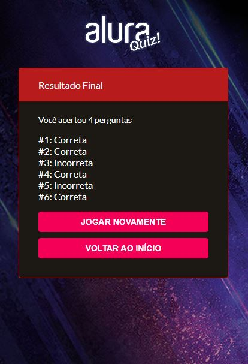

# Quiz MCU (Marvel Cinematic Universe)

 

# :page_with_curl: Table of Contents

* [About](#information_source-about)
* [Technologies](#computer-technologies)
* [Images](#camera-images)
* [How to run](#seedling-how-to-run)
* [License](#pencil-license)

# :information_source: About

This project refers to a quiz developed during the Imersão React with Next.js, provided by Alura, whose theme is the MCU (Marvel Cinematic Universe), the set of Marvel films, that ends in Avengers: Endgame.
In addition, it is possible to access and answer other quizzes developed by other participants of the event promoted by Alura.

# :computer: Technologies

- ReactJS
- Next.js
- Styled Components
- Framer Motion

# :camera: Images


<p float="left" align="center">
  
  
</p>

# :seedling: How to run

```bash
# Clone the repository
$ git clone https://github.com/lucas-almeida-silva/quiz-marvel.git

# Go to the project folder
$ cd quiz-marvel

# Install Dependencies
$ yarn
# or npm install

# Run the application
$ yarn dev
# or npm run dev
```
Access the API at http://localhost:3000

# :pencil: License

This project is under the [MIT license](LICENSE).
